# DualFix

Dual-Backbone Ensembles with Balanced-MixUp and Fixed-Epoch Checkpointing for
Early Neoplasia Detection in Barrett's Oesophagus.

This repository contains the training method developed for the
[MICCAI RARE26 challenge](https://rare26.grand-challenge.org/).

**Challenge team:** [Istanbul-Medical-Vision](https://rare26.grand-challenge.org/teams/5495/)

The task is binary classification of white-light endoscopy images into NDBE
(non-dysplastic Barrett's oesophagus) and NEO (early neoplasia).



## Method overview

DualFix combines two GastroNet-pretrained backbones, two training regimes, and
three random seeds. The final challenge entry averages the sigmoid probabilities
of 54 checkpoints with equal weight.

- Backbones: ResNet-50 and ViT-S/16
- Input size: 224 x 224 RGB
- Loss: `BCEWithLogitsLoss(pos_weight=18.6)`
- Sampling: Balanced-MixUp with `alpha=0.2`
- Optimizer: AdamW with cosine learning-rate scheduling
- Seeds: 45, 46, and 47
- Training regimes: grouped 5-fold cross-validation and full-data training
- Inference: equal mean of checkpoint probabilities, without test-time augmentation

## Evaluation

RARE26 ranks entries by PPV at 90% recall. At the challenge prevalence
`p = 1/101`, the deterministic relation between FPR at 90% recall and PPV is:

```text
PPV@90R = 0.9p / (0.9p + FPR@90 * (1 - p))
```

The repository includes the organisers' official bootstrap metric in
`evaluation_Grand-Challenge.py` and uses it outside the per-epoch training loop.

### Open Development results

The team's best Open Development submission was ranked 40th among individual
submissions on the final leaderboard:

| Team | Submission rank | PPV@90Recall (95% CI) | AUROC (95% CI) | AUPRC (95% CI) |
|---|---:|---:|---:|---:|
| [Istanbul-Medical-Vision](https://rare26.grand-challenge.org/teams/5495/) | [40](https://rare26.grand-challenge.org/evaluation/f5a12835-f758-4659-8b63-0dff22523699/) | 0.0202 (0.0117–0.0450) | 0.8278 (0.6970–0.9286) | 0.3221 (0.0882–0.5975) |

#### Top 10 teams on the Open Development leaderboard

The public leaderboard contains multiple submissions from the same teams. The
table below shows the first 10 teams after counting each named team once using
its best PPV@90Recall submission:

| Team rank | Team | Best PPV@90Recall |
|---:|---|---:|
| 1 | [SadudeeP](https://rare26.grand-challenge.org/teams/5523/) | [0.0335](https://rare26.grand-challenge.org/evaluation/faab7706-50c7-4bc1-b9a0-017b5c15bb04/) |
| 2 | [xAILab Bamberg](https://rare26.grand-challenge.org/teams/5453/) | [0.0303](https://rare26.grand-challenge.org/evaluation/24af9adf-2646-4349-b4b0-bb3d46d643a7/) |
| 3 | [GleeLAB](https://rare26.grand-challenge.org/teams/5424/) | [0.0274](https://rare26.grand-challenge.org/evaluation/3233033c-3427-470c-ac52-0cbd73df96f8/) |
| 4 | [RARE26 Team Internship Team 2](https://rare26.grand-challenge.org/teams/5334/) | [0.0271](https://rare26.grand-challenge.org/evaluation/e89bef72-9043-4061-b211-bbe368692829/) |
| 5 | [IMSY](https://rare26.grand-challenge.org/teams/5529/) | [0.0252](https://rare26.grand-challenge.org/evaluation/f9ab677f-740b-47d6-87e3-0b5636804da6/) |
| 6 | [RARE26 Team Internship Team 1](https://rare26.grand-challenge.org/teams/5321/) | [0.0223](https://rare26.grand-challenge.org/evaluation/3b551375-dee5-4095-a390-0a9d797e349f/) |
| **7** | **[Istanbul-Medical-Vision](https://rare26.grand-challenge.org/teams/5495/)** | **[0.0202](https://rare26.grand-challenge.org/evaluation/f5a12835-f758-4659-8b63-0dff22523699/)** |
| 8 | [AIMS](https://rare26.grand-challenge.org/teams/5416/) | [0.0200](https://rare26.grand-challenge.org/evaluation/4768886b-cf6b-44a3-aa64-40ff384ae63a/) |
| 9 | [QLAD](https://rare26.grand-challenge.org/teams/5646/) | [0.0196](https://rare26.grand-challenge.org/evaluation/4dba233a-cc18-49e3-88cc-be1bf5753e8a/) |
| 10 | [JCU rare26 team](https://rare26.grand-challenge.org/teams/5560/) | [0.0178](https://rare26.grand-challenge.org/evaluation/a0cbe29c-04c9-472f-b178-f439c2c1a33d/) |

This top-10 team ranking is derived from the final submission-level leaderboard;
it is not a separate official Grand Challenge ranking. Entries without a team
name displayed on the leaderboard are not included.

## Data preparation

Challenge data is access-gated and is not distributed in this repository. The
preparation script expects the extracted images in this layout:

```text
data/
├── center_1/
│   ├── ndbe/*.png
│   └── neo/*.png
└── center_2/
    ├── ndbe/*.png
    └── neo/*.png
```

Create the private manifest, near-duplicate groups, and the three pinned fold
assignments with:

```bash
python -m scripts.00_prepare_manifest
```

The generated `data/data_manifest.csv` contains challenge-derived labels and
metadata and is excluded from Git. The preparation pipeline consists of:

1. `scripts/00_prepare_manifest.py`: scans the dataset and records image metadata.
2. `scripts/01_build_groups.py`: extracts DINOv2 ViT-B/14 embeddings and creates
   within-centre near-duplicate groups.
3. `scripts/02_assign_fold_seed.py`: assigns grouped, centre-by-label-stratified
   folds for seeds 45, 46, and 47.
4. `scripts/03_lr_range_test.py`: runs an optional learning-rate range test.

The training entry point checks for duplicate rows, missing groups, fold
coverage, train/validation overlap, and groups split across folds before
training starts.

## Preprocessing and augmentation

Validation and inference use a direct 224 x 224 resize followed by ImageNet
normalization.

Training uses:

- 40% random resized crop and 60% direct resize
- horizontal and vertical flips
- random rotation
- color jitter
- sharpness jitter
- JPEG compression jitter
- ImageNet normalization

## Balanced-MixUp

Each training step pairs a naturally sampled batch with a class-balanced batch
sampled with replacement. One value `lambda ~ Beta(alpha, 1)` is drawn per batch:

```text
image = (1 - lambda) * natural + lambda * balanced
label = (1 - lambda) * y_natural + lambda * y_balanced
```

The natural sampler visits every training row once per epoch. Its optional
short batch is emitted last so both Balanced-MixUp branches remain aligned.

## Training configurations

| Configuration | Backbone | Split | Learning rate | Saved epochs |
|---|---|---|---:|---|
| `resnet50_fold.yaml` | ResNet-50 | grouped 5-fold | 5e-5 | 20, 25, 30 |
| `vits_fold.yaml` | ViT-S/16 | grouped 5-fold | 1e-5 | 10, 15, 20, 25, 30 |
| `resnet50_full.yaml` | ResNet-50 | full data | 5e-5 | 16, 20, 24, 28 |
| `vits_full.yaml` | ViT-S/16 | full data | 1e-5 | 16, 20, 24, 28 |

The ViT configurations use a three-epoch linear warmup before cosine decay.
Full-data runs use every row for training and therefore do not provide a
held-out validation estimate.

## Final ensemble

| Family | Training regime | Checkpoints |
|---|---|---:|
| ResNet-50 | full data, 3 seeds x 4 epochs | 12 |
| ViT-S/16 | full data, 3 seeds x 4 epochs | 12 |
| ResNet-50 | grouped 5-fold, 3 seeds, epoch 30 | 15 |
| ViT-S/16 | grouped 5-fold, 3 seeds, epoch 30 | 15 |
| **Total** |  | **54** |

The final weights and Grand Challenge container artifact are not distributed.
This repository documents and implements the training method; it is not a
packaged inference application.

## Installation and training

Create an isolated Python environment and install the dependencies:

```bash
pip install -r requirements.txt
```

Obtain the two GastroNet pretrained checkpoints from
[Theta Vision Cortex](https://cortex.thetavision.nl/dataset-provider/listing/2/)
and place them under `weights/` with these names. The publisher's
[archived model card](https://huggingface.co/tgwboers/GastroNet-5M_Pretrained_Weights/blob/cbb7b27ea186417f7d0be10e17dbc5898d255214/README.md)
identifies the release license as CC BY-NC-ND 4.0; users must review and follow
the applicable terms.

```text
weights/RN50_Billion-Scale-SWSL%2BGastroNet-5M_DINOv1.pth
weights/VITS_GastroNet-5M_DINOv1.pth
```

Prepare the private manifest and run the preflight checks:

```bash
python -m scripts.00_prepare_manifest
python train.py --config configs/resnet50_fold.yaml --preflight-only
python train.py --config configs/vits_fold.yaml --preflight-only
python train.py --config configs/resnet50_full.yaml --preflight-only
python train.py --config configs/vits_full.yaml --preflight-only
```

Run the four training arms:

```bash
python train.py --config configs/resnet50_fold.yaml
python train.py --config configs/vits_fold.yaml
python train.py --config configs/resnet50_full.yaml
python train.py --config configs/vits_full.yaml
```

Checkpoints and JSON metadata sidecars are written below `models/`. Per-epoch
validation curves are stored as compressed NumPy files.

Run the test suite with:

```bash
pytest
```

The Colab workflow in `notebook/colab_training.ipynb` requires the user to set
an exact Git commit SHA and explicitly select the configurations before it will
mount Drive or start training.

## Repository layout

```text
configs/                       final training configurations
docs/                          pipeline diagram source and SVG
notebook/                      guarded Colab training workflow
scripts/00_prepare_manifest.py dataset scan and pipeline orchestration
scripts/01_build_groups.py     DINOv2 near-duplicate grouping
scripts/02_assign_fold_seed.py pinned grouped fold generation
scripts/03_lr_range_test.py    optional LR range test
src/                           datasets, models, losses, metrics, and trainer
tests/                         unit and preflight tests
evaluation_Grand-Challenge.py  official RARE challenge metric
train.py                       training entry point
```

## Limitations

- The dataset contains only two acquisition centres. Centre-dependent image
  characteristics may reduce generalization to unseen centres.
- The full-data arm has no held-out validation set.
- The 54-model ensemble is computationally expensive and is not intended as a
  clinical deployment package.
- Challenge data, pretrained weights, final weights, and the submission
  container are not redistributed here. Users must obtain applicable assets
  from their respective owners and follow their licenses.

## References

- Galdran et al., [Balanced-MixUp for Highly Imbalanced Medical Image
  Classification](https://arxiv.org/abs/2109.09850), MICCAI 2021.
- Oquab et al., [DINOv2: Learning Robust Visual Features without
  Supervision](https://arxiv.org/abs/2304.07193), 2023.
- [GastroNet-5M pretrained weights](https://cortex.thetavision.nl/dataset-provider/listing/2/)
  and the publisher's [archived model card](https://huggingface.co/tgwboers/GastroNet-5M_Pretrained_Weights/blob/cbb7b27ea186417f7d0be10e17dbc5898d255214/README.md).

## License

The participant-authored code in this repository is released under the
[MIT License](LICENSE). The organisers' evaluation metric is redistributed
under its upstream MIT license; see [Third-party notices](THIRD_PARTY_NOTICES.md).
Challenge data, pretrained model weights, final model weights, and the
organisers' container template are not included and remain subject to their
respective terms.
